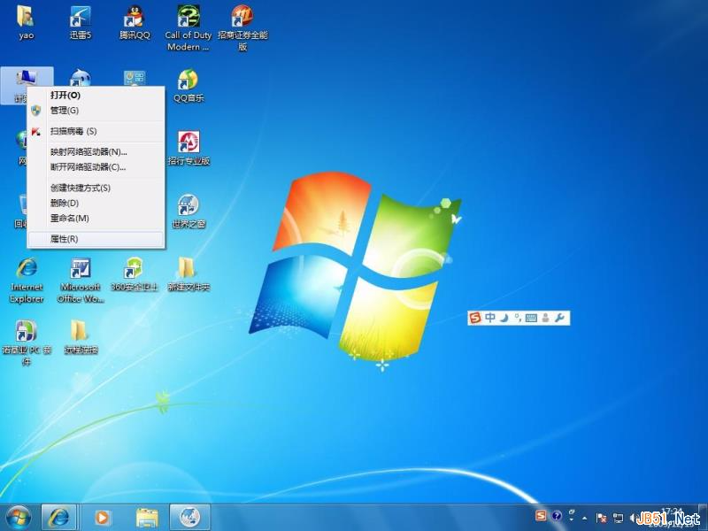
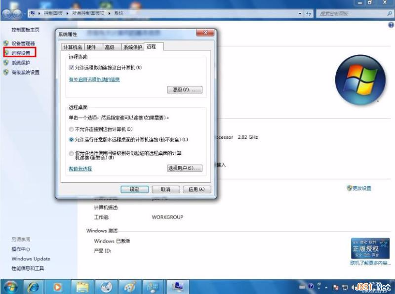
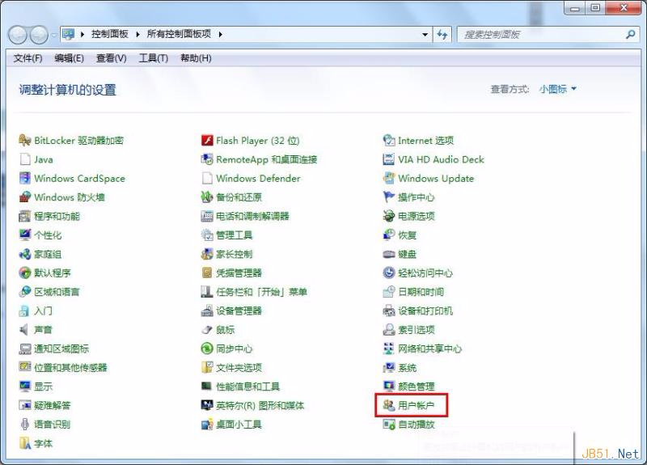
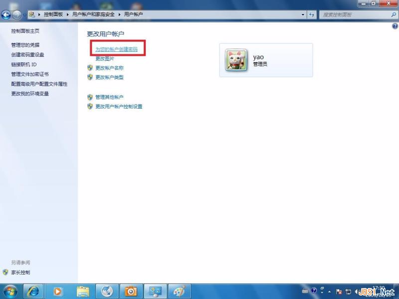
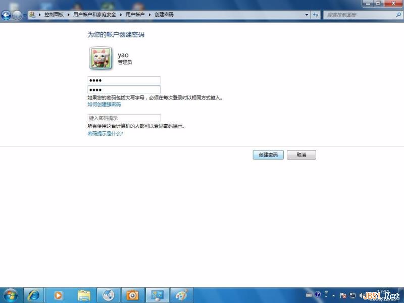
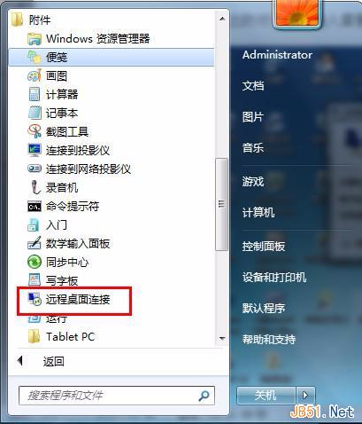
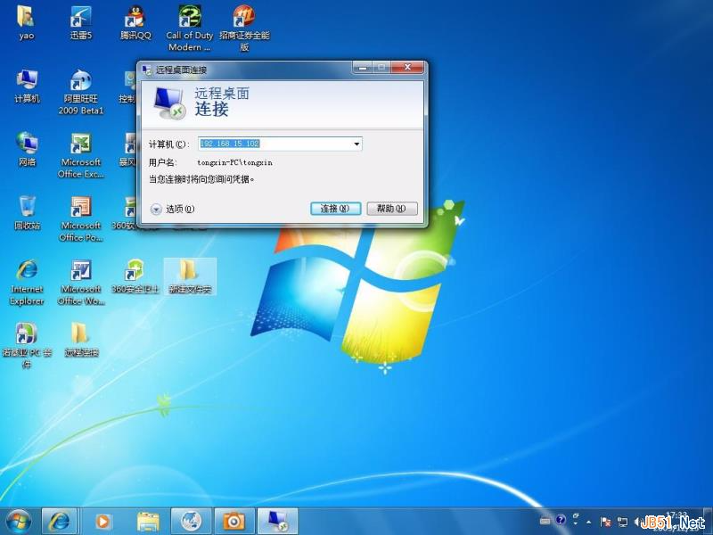
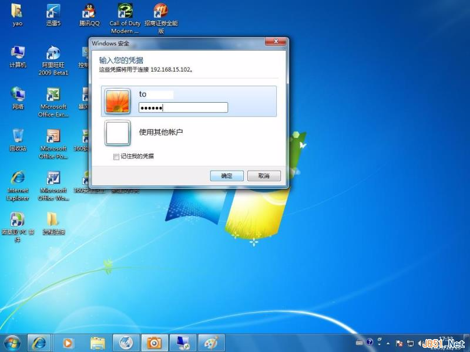

# Windows7开启远程桌面连接详细图文教程

作者：佚名 字体：[[增加]() [减小]()] 来源：互联网 时间：04-27 15:06:12[ 我要评论](http://www.jb51.net/os/windows/318376.html#comments)

这篇文章主要介绍了Windows7开启远程桌面连接详细图文教程,本文用详细的图文说明讲解了开启远程桌面的操作步骤,需要的朋友可以参考下

　　如果您有多台电脑且分部在不同的地方。那么如何使用一台电脑对其他电脑进行控制呢?其实win7系统自带了远程连接功能，下面就为大家介绍windows 7 远程桌面连接的方法。

　　1.使用鼠标右键“计算机”图标，选择“属性”打开。如图一

图一

　　2.在打开的系统窗口右侧点击“远程设置”按钮，勾选“允许远程协助连接这台计算机”，接着在下面选择“运行运行任意版本远程桌面的计算机连接”，点击确定进入下一步。如图二

 

图二

 

 

图三

　　4.进入”用户账户“选项后，点击”为您的账户创建密码“选项，进入下一步。如图四

 

图四

 

　　5.在文本框内输入你要设置的密码，然后点击创建密码即可。如图五

 

图五

 

　　6.windows 7 远程桌面连接密码设置完成后，我们开启另外一台电脑。点击开始按钮，在附件中选择远程桌面连接选项，进入下一步。如图六

 

图六

 

　　8.在弹出的对话框中输入需要进行windows 7 远程桌面连接的计算机的IP地址，然后点击“连接”，进入下一步。如图七

 

图七

 

　　9.在新弹出的窗口中输入已经设定好的账户和密码，点击“确定”即可。如图八

 

图八

 

　　10.这时就成功的进行了远程桌面连接了。如图九

 

图九

 

　　windows 7 远程桌面连接就是这么简单，如果您有多台电脑或者对他人进行远程协助可以使用这个方法哦!

来源： <http://www.jb51.net/os/windows/318376.html>