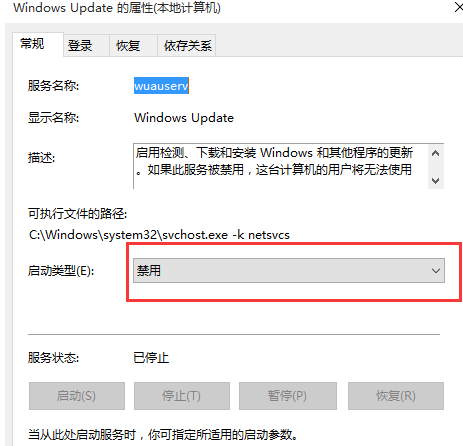
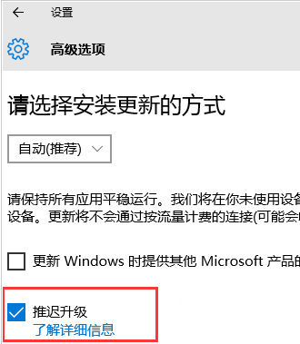
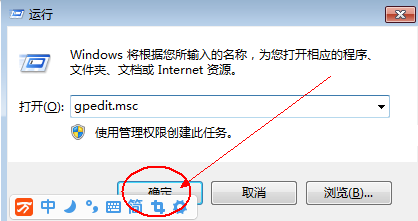
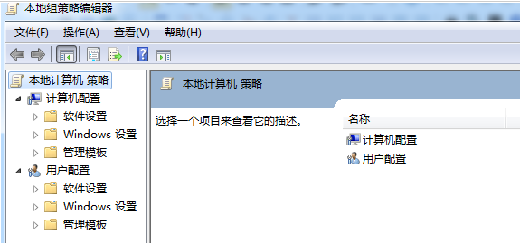
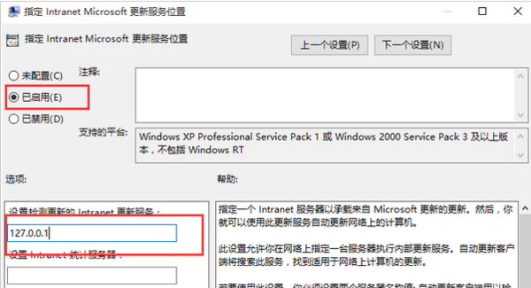

工具原料：电脑+win10

Win10系统关闭自动更新方法如下：

### 方法一：关闭更新服务

1、按WIN+R 打开运行，输入 services.msc 回车 然后找到 “Windows updata”服务，双击后设置为禁用 应用即可;

### 方法二：推迟自动更新

微软在win10系统中Windows更新处虽然没有提供关闭自动更新的选项，不过却提供了延迟更新的选项;

操作步骤：打开win10系统的Windows更新，点击高级选项，勾选“推迟升级”选项即可;

勾选“推迟升级”

### 方法三：为windows更新指定一个错误的升级服务器地址

1、按“Win+R”组合键打开运行输入“gpedit.msc”再点“确定”;

再点“确定”

2、打开“本地组策略编辑器”展开“管理模版”→“Windows组件”;

3、接着双击“Windows组件”找到“Windows Update;

4、在“Windows Update”内找到“指定Intranet Microsoft更新服务位置”;

5、选中“指定Intranet Microsoft更新服务位置”右键编辑;

6、将“未配置”框选为“已启用”。在“设置检测更新的Intranet更新服务”填写127.0.0.1 (注：127.0.0.1为本机IP)。

### 注意事项：

1. 新的Windows系统，要求用户接受每一次更新。“Windows 10家庭版”用户完全无法逃避更新;“

2. Windows10专业版”用户有8个月的时间来推迟安装更新，但同样无法拒绝;

3. 只有“Windows 10企业版”高级用户才能无限期推迟更新。

   来源： <https://zhidao.baidu.com/question/1950222412485439508.html>