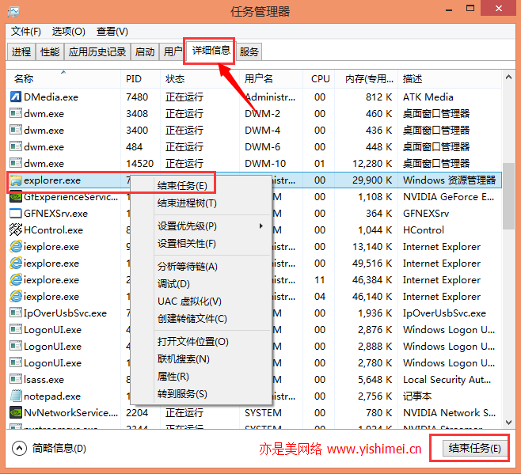

经常在网上看到有同学反映，他们在控制面板里卸载软件的时候，总是会出现2502、2503错误代码的问题，并且这个问题大多出现在win8.1、win10等系统上，其中尤其以64位系统为多，还有的同学在安装软件的时候也会出现2502、2503错误代码的提示，其实导致这个问题的原因就是对系统的操作权限不足，只要我们取得了系统超级权限或管理员权限后再次进行操作就没有问题了，但是很多同学都反映右键点击软件并没有“以管理员身份运行”的选项，那么今天亦是美网络小编就给大家详细的介绍win10/win8.1系统在安装、卸载软件时出现2502、2503错误代码的问题。

首先打开任务管理器，可以通过右键点击桌面上的任务栏打开任务管理器，也可以通过同时按下键盘上的Ctrl+Alt+Delete键打开任务管理器。

打开任务管理器后，切换到“详细信息”选项卡，找到explore.exe这个进程，如下图所示： 

我们可以通过右键结束explore.exe这个进程，也可以通过选中它后，点击下面的结束任务进行结束。

接下来，点击任务管理器上面的“文件” - “运行新任务”，如下图： 

在里面输入“explorer.exe”，然后勾选“以系统管理权限创建此任务”，之后点击“确定”即可。接下来就可以正常安装或卸载你的软件了。

tips：其实整个过程其实就是把explorer.exe（资源管理器）重启了一下，有的同学说直接在任务管理器里右键点击explorer.exe进行重启不行吗？答案是不行的！因为这样重启后，依然没有系统管理权限，只有我们用上面提供的方法重启explorer后才具有系统管理权限的。

来源： <http://www.yishimei.cn/network/551.html>