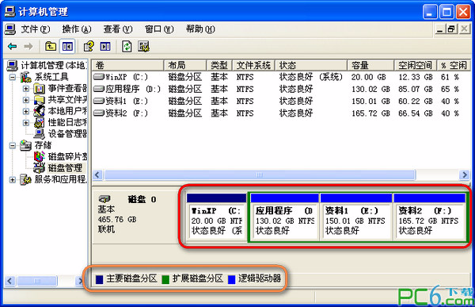
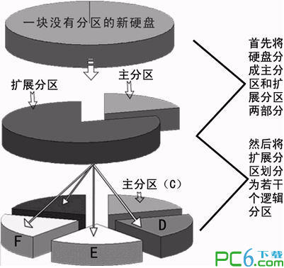

很多人都会给硬盘进行分区操作，也知道系统盘一般装于C盘，其它盘存储软件、文档、电影等资料。感觉通常我们使用硬盘分区工具给硬盘划分区域时就像切蛋糕一样，对不对？

那么你知道这些分区之间还有主分区、扩展分区、逻辑分区、活动分区四种类型的划分吗？本文就为你详细讲解四种硬盘分区的由来与作用。

点击这里可下载[硬盘分区软件](http://www.pc6.com/pc/ypfqrj/)：

-  [pqmagic(硬盘分区魔术师)9.0中文版](http://www.pc6.com/softview/SoftView_52893.html)

  授权：免费软件 大小：6KB 语言： 简体

[下载地址](http://www.pc6.com/softview/SoftView_52893.html)本周共下载 28466 次

-  [分区助手专业版V5.5 免费版](http://www.pc6.com/softview/SoftView_53411.html)

  授权：免费软件 大小：7.0M 语言： 简体

[下载地址](http://www.pc6.com/softview/SoftView_53411.html)本周共下载 3260 次

给新硬盘

上建立分区时都要遵循以下的顺序：建立主分区→建立扩展分区→建立逻辑分区→激活主分区→格式化所有分区。

分区从实质上说就是对硬盘的一种格式化。当我们创建分区时，就已经设置好了硬盘的各项物理参数，指定了BIOS系统下硬盘主引导记录(即Master Boot Record，一般简称为MBR)和引导记录备份的存放位置。
而对于文件系统以及其他操作系统管理硬盘所需要的信息则是通过之后的高级格式化，即Format命令来实现。

硬盘的分区由主分区、扩展分区和逻辑分区组成：主分区(注意扩展分区也是一个主分区)的最大个数是四个，其个数是由硬盘的主引导记录MBR(Master Boot Recorder)决定的，MBR存放启动管理程序(如GRUB)和分区表记录。扩展分区下又可以包含多个逻辑分区 --- 所以主分区范围是从1-4，逻辑分区是从5开始的。

window和linux支持的分区结构：
windows和linux支持图四图五图六图七的分区机构，即：
一个主分区+一个扩展区
二个主分区+一个扩展区
三个主分区+一个扩展区
四个独立主分区

**主分区**：也叫引导分区，最多可能创建4个，当创建四个主分区时候，就无法再创建扩展分区了，当然也就没有逻辑分区了。主分区是独立的，对应磁盘上的第一个分区，“一般”就是C盘。在Windows系统把所有的主分区和逻辑分区都叫做“盘”或者“驱动器”，并且把所有的可存储介质都显示为操作系统的“盘”。因此，从“盘”的概念上无法区分主分区和逻辑分区。并且盘符可以在操作系统中修改，这就是要加上“一般”二字的原因。

**扩展分区**：除了主分区外，剩余的磁盘空间就是扩展分区了，扩展分区是一个概念，实际上是看不到的。当整个硬盘分为一个主分区的时候，就没有了扩展分区。

**逻辑分区**：在扩展分区上面，可以创建多个逻辑分区。逻辑分区相当于一块存储截止，和操作系统还有别的逻辑分区、主分区没有什么关系，是“独立的”。

**活动分区**：就是当前活动的、操作系统可以启动的分区。

格式化是针对主分区和逻辑分区的。要格式化是因为这和操作系统管理文件系统有关系。没有格式化的分区就像一张白纸，要写入数据，必须对白纸打上“格子”，每个格子里面写一块。而操作系统只认这些格子。

转：http://www.pc6.com/infoview/Article_53651.html